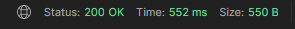

# **LeverX-Course-Project**

`@author Valeriy Liashuk`

# Requirements:
* Programming language: [Java & JDK 15](https://www.java.com)<a href="https://www.java.com" target="_blank">  </a>
* Build system: [Maven](https://maven.apache.org/)
* Control system: [Git](https://git-scm.com/)
* Testing: 
    - [JUnit5](https://junit.org/junit5/)
    - [Mockito](http://site.mockito.org/)
* Log: [Slf4j](http://www.slf4j.org/)
* Database: [PostgreSQL](https://www.postgresql.org/)
* Frameworks: [Spring Boot](https://spring.io/projects/spring-boot)


# Build Application:
```
  1. Go to the application.properties and write your DB configuration and free port
    for starting embedded Tomcat.
  2. Press SHIFT+F10 and boot application
```

# How it works:
  1. Go to the postman and send request to register new account

  
  
  Body of registered account should look like:
  

  In url after "/" you should choose role of your person:
  
  1 - Admin

  2 - Trader

  3 - Guest

  If you send good request server give you status 200, and your account info
  
  

  

  2. Try to login with your account

  

  Body of auth request should look like:

  

  If you send good request server give you status 200, and your generated token

  

  3. Copy your token and put it to header named "Authorization"

  

  Your token should have string "Bearer_" at start of it

  4. Try to make any request which allowed to your role for example i will choose this one:

  

  If all fine server give you status 200, and return List of available games

  

  


# Rest Endpoints:


# Authentication

`url which available without authentication`

  
Registration
```
  POST 'http://localhost:8080/api/auth/register/{roleId}'
```
Login
```
  POST 'http://localhost:8080/api/auth/login'
```


# Admin-URL

`url which available only for users with role 'ADMIN'`


# Comments
Update comment `Approve comment`
```
  PATCH 'http://localhost:8080/api/admin/comments/{id}'
```

Get by id comment
```
  GET 'http://localhost:8080/api/admin/comments/{id}'
```

Get all comments
```
  GET 'http://localhost:8080/api/admin/comments/'
```


# Games


Create game
```
  POST 'http://localhost:8080/api/admin/games/'
```
Update game
```
  PATCH 'http://localhost:8080/api/admin/games/{id}'
```
Delete game
```
  DELETE 'http://localhost:8080/api/admin/games/{id}'
```
Get by id game
```
  GET 'http://localhost:8080/api/admin/games/{id}'
```
Get all games
```
  GET 'http://localhost:8080/api/admin/games/'
```


# Users


Delete user
```
  DELETE 'http://localhost:8080/api/admin/users/{id}'
```
Get by id user
```
  GET 'http://localhost:8080/api/admin/users/{id}'
```
Get all users
```
  GET 'http://localhost:8080/api/admin/users/'
```


# Guest-URL


`url which available only for users with role 'GUEST'`

Create comment
```
  POST 'http://localhost:8080/api/guests/{userId}'
```
Get comments by userId
```
  GET 'http://localhost:8080/api/guests/{userId}'
```
Get all my comments
```
  GET 'http://localhost:8080/api/guests/my'
```
Get all comments
```
  GET 'http://localhost:8080/api/guests/'
```
Delete comment
```
  DELETE 'http://localhost:8080/api/guests/{id}'
```


# Trader-URL


`url which available only for users with role 'TRADER'`

Reset password
```
  PATCH 'http://localhost:8080/api/traders/forgot'
```
Create gameobject
```
  POST 'http://localhost:8080/api/traders/objects'
```      
Update gameobject
```
  PATCH 'http://localhost:8080/api/traders/objects/{id}'
```
Delete gameobject
```
  DELETE 'http://localhost:8080/api/traders/objects/{id}'
```
Get all my gameobjects
```
  GET 'http://localhost:8080/api/traders/objects/my'
```
Get all my comments
```
  GET 'http://localhost:8080/api/traders/comments/my
```
Gel all games
```
  GET 'http://localhost:8080/api/traders/games/'
```

